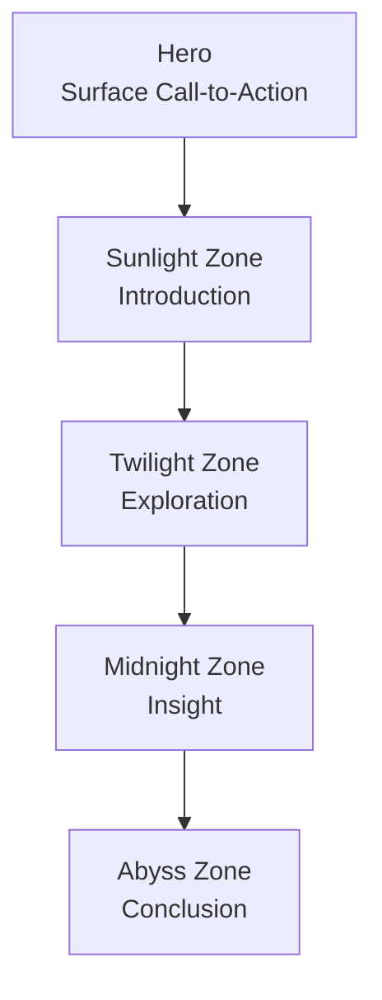
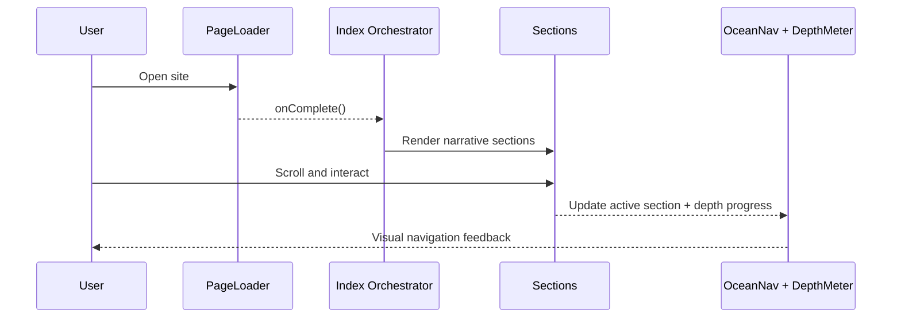

# Ocean Depths - Interactive Storytelling Experience

<div align="center">

Immersive scroll-driven narrative for Frontend Odyssey (IIT Patna)

[](https://react.dev)
[](https://www.typescriptlang.org)
[](https://www.framer.com/motion/)
[](https://tailwindcss.com)
[](https://vitejs.dev)

[Architecture](./architecture.md) | [Project Documentation](./projectdocumentation.md)

</div>

## Problem Fit

This project is built for Theme 4: Ocean Depths from Frontend Odyssey.
It is intentionally designed as a cinematic, exploratory web experience, not a static page.

## 200-300 Word Submission Description

Ocean Depths is a cinematic, scroll-first storytelling website that transforms marine science into an immersive digital journey. Built for Frontend Odyssey at IIT Patna, the experience guides users from the bright ocean surface to the deepest trenches through five narrative stages: Hero, Introduction, Exploration, Insight, and Conclusion.

Every section has its own atmosphere, motion language, and interaction model. As users descend, backgrounds darken, typography becomes more dramatic, and ambient systems such as bubbles, glow particles, and wave transitions evolve to reflect changing depth. Scroll-linked parallax, reveal animations, and section transitions are used as narrative tools rather than decorative effects. This creates a continuous sense of movement and discovery.

Interactivity is embedded throughout the story: users can engage with marine creature cards, expand contextual fact panels, trigger quote reveals, navigate by depth-aware top navigation, and monitor progression with a live depth meter. A custom cursor adds tactile feedback on desktop, while touch devices receive an optimized cursor-free interaction model.

The project is built with React, TypeScript, Framer Motion, and Tailwind CSS using reusable components and token-based styling. Accessibility and robustness were prioritized with keyboard support, semantic labels, and reduced-motion fallbacks. The final output is a polished, high-performance storytelling product aimed at Awwwards-level presentation while remaining maintainable and production-ready.

## Experience Map



## Interaction and Animation Matrix

| Requirement | Implementation in Project | Status |
|---|---|---|
| 5 story sections | Hero, Sunlight, Twilight, Midnight, Abyss | Passed |
| 2+ scroll effects | Parallax layers, scroll reveal, sticky depth meter/nav | Passed |
| 3+ interactions | Creature cards, expandable cards, quote reveal, nav jumps, CTA scroll | Passed |
| 3+ animations | Page loader, wave morphing, particle fields, transition separators, cursor springs | Passed |
| Responsive design | Mobile/tablet/desktop layouts and motion scaling | Passed |

## System Flow



## Tech Stack

| Layer | Technology | Why |
|---|---|---|
| UI Framework | React 18 | Composable section architecture |
| Language | TypeScript | Safer scalable code |
| Motion | Framer Motion | Scroll-linked and spring animations |
| Styling | Tailwind CSS + CSS variables | Rapid themed UI with design tokens |
| Bundler | Vite | Fast dev server and production build |

## Folder Structure

```text
src/
  components/
    sections/
      HeroSection.tsx
      SunlightZone.tsx
      TwilightZone.tsx
      MidnightZone.tsx
      AbyssSection.tsx
    Bubbles.tsx
    CustomCursor.tsx
    DepthMeter.tsx
    OceanNav.tsx
    PageLoader.tsx
    ParallaxLayer.tsx
    ScrollReveal.tsx
    SectionTransition.tsx
  pages/
    Index.tsx
```

## Setup and Run

```bash
npm install
npm run dev
```

Production build:

```bash
npm run build
npm run preview
```

## Deployment

Vercel:
1. Import repository.
2. Framework preset: Vite.
3. Build command: npm run build.
4. Output directory: dist.

Netlify:
1. Connect repository.
2. Build command: npm run build.
3. Publish directory: dist.

## Judging Optimization Notes

| Judging Criterion | Strategy Applied |
|---|---|
| Creativity and Storytelling (30%) | Depth-based narrative progression and thematic transitions |
| Visual Design (25%) | Premium typography, glow system, atmosphere gradients |
| Animation and Interactivity (20%) | Scroll choreography plus direct user-triggered components |
| Responsiveness (15%) | Adaptive layout and motion behavior on all breakpoints |
| Code Quality (10%) | Reusable components, clean separation of sections and utilities |

## Accessibility and Performance

- Keyboard-operable interactive elements
- ARIA labels on major sections and controls
- Reduced-motion fallback for users with motion sensitivity
- SVG and CSS-driven visuals to avoid heavy image payloads

## Author and Event

Submitted for Frontend Odyssey: The Interactive Web Experience Challenge, IIT Patna (2026).
