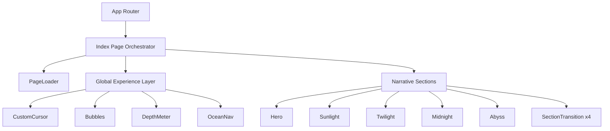
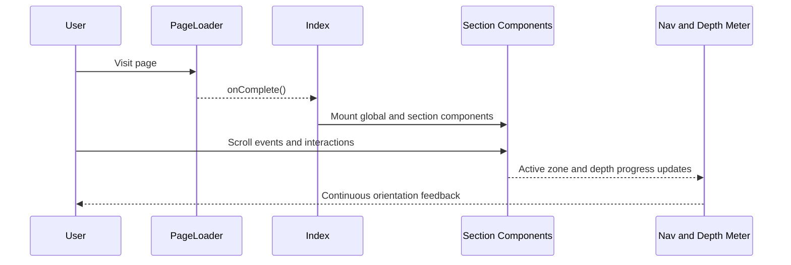
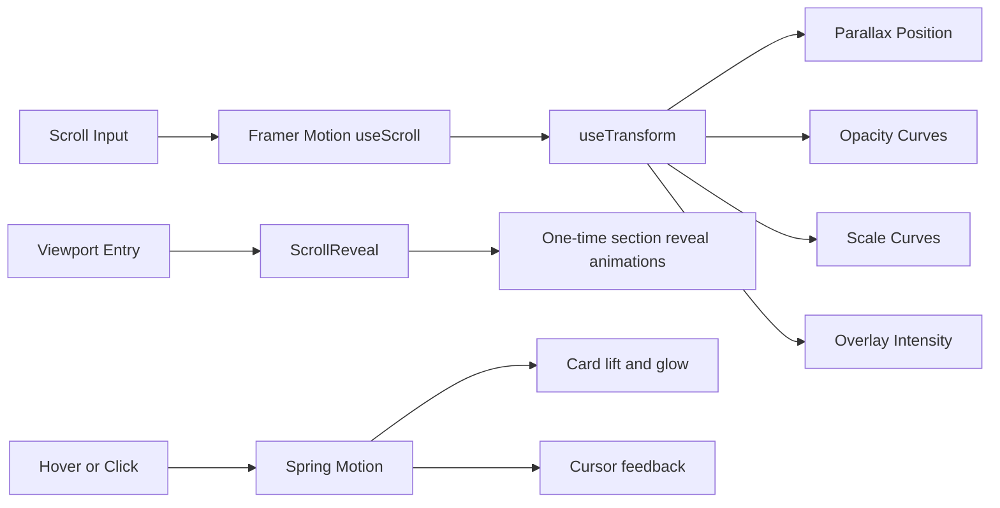
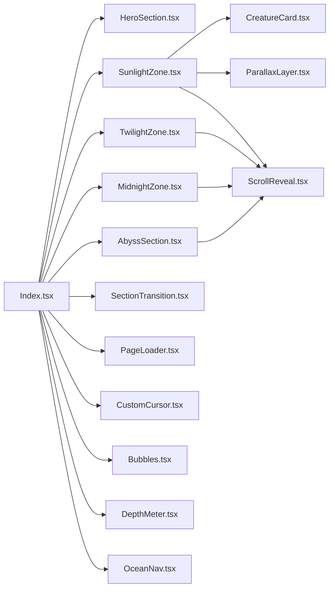
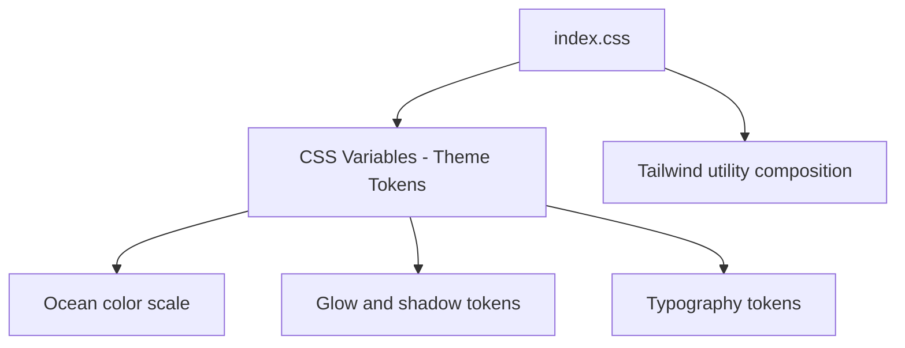
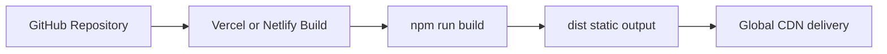

# Architecture - Ocean Depths

## Purpose

This document captures the architecture for a scroll-driven storytelling experience built for Frontend Odyssey. The system prioritizes cinematic transitions, composable sections, responsive behavior, and maintainable animation patterns.

## High-Level System

## Narrative-to-Technical Mapping

| Story Stage | Section Component | Core Mechanics |
|---|---|---|
| Hero | HeroSection | Intro animations, call-to-action, surface ambience |
| Introduction | SunlightZone | Parallax rays, stat reveals, creature cards |
| Exploration | TwilightZone | Bioluminescent particles, expandable insight cards |
| Insight | MidnightZone | Interactive creature explorer, pressure visual bars |
| Conclusion | AbyssSection | Final stats, quote reveal, return-to-surface action |

## Runtime Flow

## Motion Architecture

## Component Graph

## Styling and Design System

Key choices:
- HSL tokens to smoothly tune depth color transitions.
- Display and body font split for editorial tone plus readability.
- Reusable utility classes for glow and shadow consistency.

## State and Responsibility Model

| Area | Scope | Owner Component |
|---|---|---|
| Initial loading gate | Page-level | Index + PageLoader |
| Active card states | Section-local | Sunlight/Twilight/Midnight/Abyss |
| Scroll progress visuals | Global overlay | DepthMeter + OceanNav |
| Cursor feedback | Global desktop-only | CustomCursor |

## Performance Characteristics

| Technique | Current Implementation |
|---|---|
| Asset strategy | SVG/CSS effects, minimal heavy media |
| Motion strategy | Transform and opacity-dominant animations |
| Reduced motion | CSS media query fallback and cursor disable path |
| Re-render boundaries | Localized section state keeps updates scoped |
| Build pipeline | Vite optimized production output |

## Accessibility Strategy

| Area | Implementation |
|---|---|
| Keyboard support | Buttons and role=button patterns with key handlers |
| Landmark semantics | Main and section labels for screen readers |
| Motion sensitivity | prefers-reduced-motion support |
| Touch behavior | Custom cursor disabled for coarse pointers |

## Responsiveness

| Breakpoint | Behavior |
|---|---|
| Mobile | Stacked content and touch-first interactions |
| Tablet | Expanded grids and balanced spacing |
| Desktop | Full cursor and richer motion density |

## Scalability and Extension Plan

1. Add optional audio layer per depth zone with mute control.
2. Integrate lightweight CMS or JSON content source for theme variants.
3. Add route-level split for future multi-story editions.
4. Add automated visual regression checks in CI.

## Deployment Architecture

