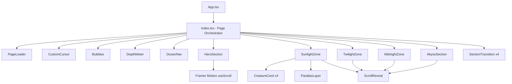
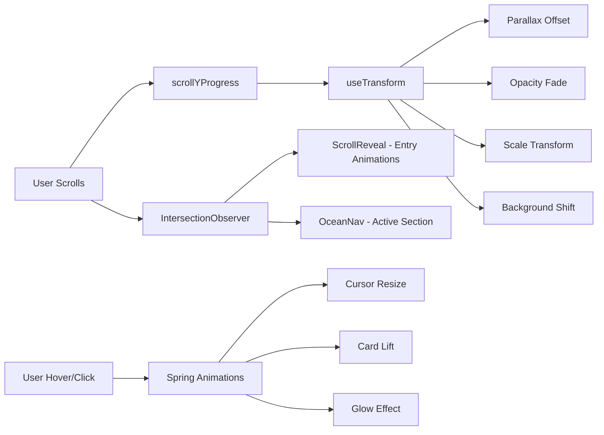
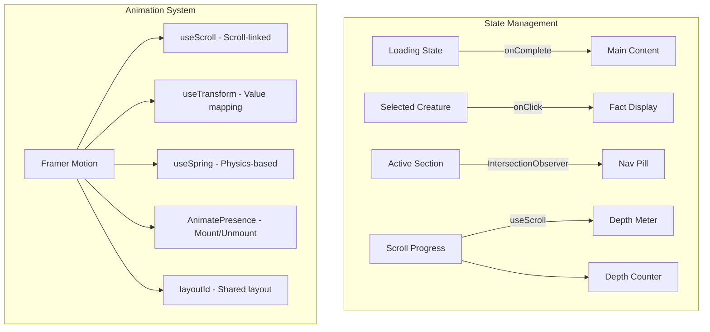
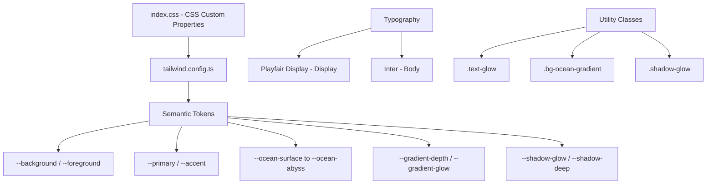
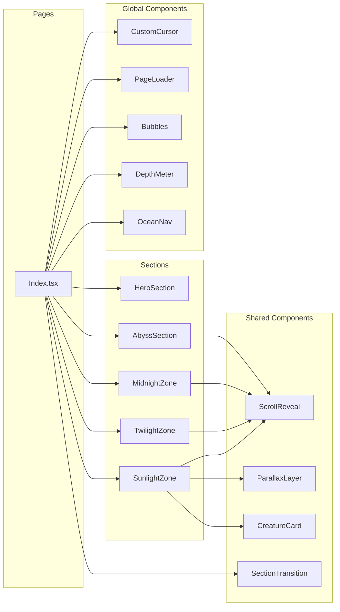

# Architecture — Ocean Depths

## System Architecture

This document outlines the technical architecture of the Ocean Depths interactive storytelling experience.

## Component Architecture

## Animation Pipeline

## Data Flow

## Design System Architecture

## File Dependency Graph

## Performance Strategy

| Technique | Implementation |
|-----------|---------------|
| Code splitting | React.lazy for route-level splitting |
| Animation optimization | `will-change`, GPU-composited transforms |
| Reduced motion | Respects `prefers-reduced-motion` |
| Asset optimization | SVG-based graphics, no heavy images |
| Scroll optimization | `useScroll` with passive listeners |
| Component memoization | `useCallback` for stable references |

## Responsive Breakpoints

| Breakpoint | Screen | Adaptations |
|------------|--------|-------------|
| `sm` (640px) | Mobile landscape | Stack layouts, larger touch targets |
| `md` (768px) | Tablet | Show depth meter, navigation |
| `lg` (1024px) | Desktop | Full animations, custom cursor |
| `xl` (1280px) | Large desktop | Maximum visual fidelity |
