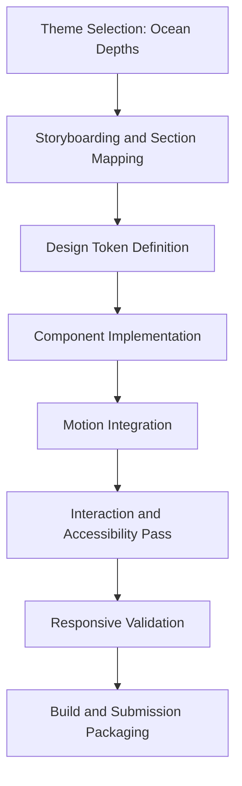
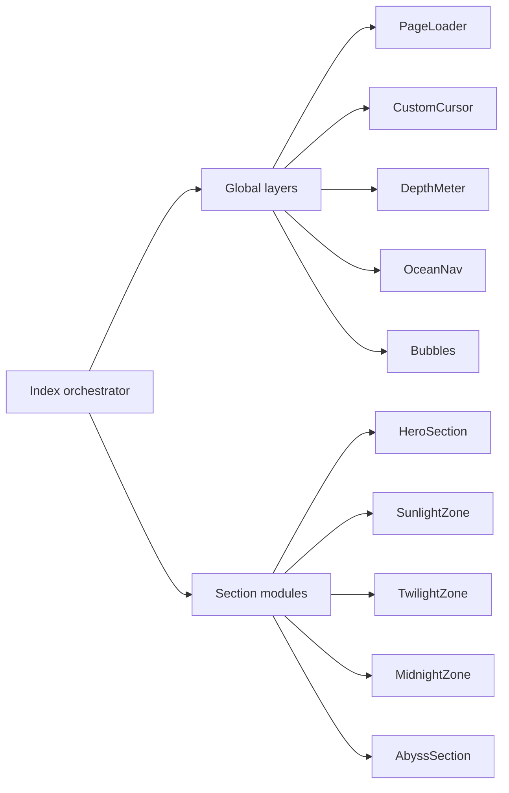
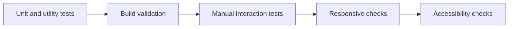

# Project Documentation - Ocean Depths

## Objective

Build an immersive, scroll-native storytelling product for Frontend Odyssey where users feel like they are descending through ocean layers, not reading a static webpage.

## Project Description (200-300 words)

Ocean Depths is an interactive web story that turns the descent through marine zones into a cinematic digital journey. Designed for Frontend Odyssey at IIT Patna, it blends narrative pacing, motion design, and tactile UI interactions to create an experience inspired by premium Awwwards-style websites.

The narrative is structured into five connected stages: Hero, Sunlight, Twilight, Midnight, and Abyss. Each stage uses a distinct visual identity and interaction profile. As the user scrolls deeper, scene composition shifts from bright gradients and wave accents to sparse bioluminescent particles and near-black trench atmospheres. This progression communicates scientific depth change through visual language, not only text.

The implementation focuses on purposeful animation. Parallax movement, reveal choreography, sticky progress indicators, and section transitions are synchronized with user scrolling to maintain continuity. Interactive elements include marine creature cards, expandable knowledge blocks, quote reveal mechanics, and depth-aware navigation. A desktop custom cursor enhances tactile feedback while automatically disabling on touch devices and reduced-motion preferences.

From an engineering standpoint, the project uses React, TypeScript, Framer Motion, and Tailwind CSS with tokenized styling and reusable section primitives. Accessibility is addressed through keyboard support, semantic labeling, and motion fallbacks. The final result is a production-ready storytelling interface that balances creativity, performance, responsiveness, and clean architecture to maximize hackathon scoring across all judging categories.

## End-to-End Workflow

## Section Narrative Breakdown

| Stage | Purpose | Visual and Interaction Strategy |
|---|---|---|
| Hero | Hook and orientation | Loader transition, large typography, CTA dive |
| Sunlight | Introduction | Light-ray parallax, stat cards, creature hover cards |
| Twilight | Exploration | Bioluminescent effects, expandable insight panels |
| Midnight | Insight | Interactive creature selector and facts panel |
| Abyss | Conclusion | Deep stats, quote reveal, return-to-surface action |

## Technical Execution Model

## Mandatory Requirement Compliance

| Rule | Implemented Feature | Status |
|---|---|---|
| At least 5 sections | Hero, Sunlight, Twilight, Midnight, Abyss | Completed |
| At least 2 scroll effects | Parallax transforms + scroll reveal + sticky depth UI | Completed |
| At least 3 interactions | Card hover, card expansion, creature selector, quote reveal, nav jumps | Completed |
| At least 3 animations | Loader, transitions, particles, glow pulses, cursor springs | Completed |
| Responsive on all devices | Mobile/tablet/desktop breakpoints with adaptive density | Completed |

## Problem-Solving Approach

1. Treat motion as storytelling grammar, not decoration.
2. Keep logic local per section for maintainability.
3. Share reusable animation primitives to avoid duplication.
4. Use token-based theming for depth-aware visual consistency.
5. Provide progressive enhancement for desktop while preserving touch usability.

## Testing Strategy

Validation checklist:
- Build passes with production configuration.
- Core interactions tested with mouse and keyboard.
- Scroll narrative verified at mobile, tablet, and desktop widths.
- No blocked navigation when custom cursor is disabled.
- Reduced-motion preference confirmed.

## Production Readiness

| Area | Readiness Notes |
|---|---|
| Maintainability | Modular section architecture and reusable components |
| Deployment | Vite build outputs static dist for Vercel/Netlify |
| Performance | Transform-based animations, lightweight visual assets |
| Accessibility | Keyboard operability, labels, reduced-motion support |
| Extensibility | New themes can be added as additional section sets |

## Advantages

- High visual impact with strong narrative continuity
- Strong alignment with hackathon judging matrix
- Balanced creativity and code quality
- Easy to iterate and extend under time constraints

## Future Enhancements

1. Add optional ambient audio with user-controlled mute toggle.
2. Introduce content-driven data mode (JSON/CMS) for reusable story themes.
3. Add screenshot-based visual regression tests in CI.
